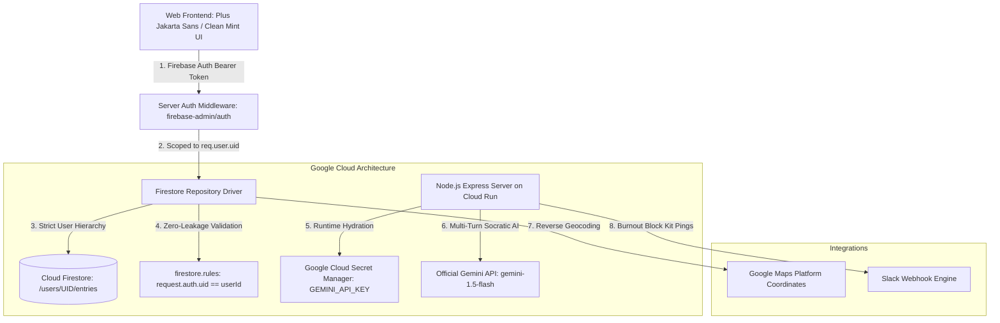

# 🌿 Gemini Journal — Production AI Journaling on Google Cloud Run

> **Google Cloud Gen AI Academy APAC Edition – Cohort 3: "Accelerate AI with Cloud Run"**  
> An authenticated, secure, and production-grade AI-powered personal journaling web application built on Google Cloud Run, Cloud Firestore, Firebase Authentication, Google Cloud Secret Manager, and the Gemini API.

[](https://cloud.google.com/run)
[](https://firebase.google.com)
[](https://firebase.google.com/docs/firestore)
[](https://ai.google.dev)
[](https://cloud.google.com/secret-manager)

---

## 🌟 The "Why" (Human Narrative & Problem Statement)

In our hyper-connected modern workflow, developers and knowledge workers face relentless context switching, resulting in creeping cognitive fatigue and silent burnout. While traditional journaling has long been recognized as a premier practice for mental clarity, paper diaries and standard note apps are passive: they store text, but cannot listen, identify cognitive distortions, or alert us when stress reaches an inflection point.

**Gemini Journal** was built to transform personal journaling from a passive archive into an **active, empathetic emotional compass**. Our mission was to engineer a private, enterprise-grade sanctuary that respects strict role-isolated data boundaries while providing Socratic AI reflection, spatial memory exploration, proactive burnout prevention, and a Spotify-style annual retrospective.

---

## 🏛️ System Architecture



---

## 🚀 Key Features & Novelty ("What is Best")

### 1. 🛡️ The 4 Technical Baselines (Zero Disqualification)
- **User Authentication:** Robust federated sign-in powered by **Firebase Authentication** (Google OAuth & Email/Password) with backend token verification via Firebase Admin SDK.
- **Conversational AI:** Real-time multi-turn reflective brainstorming and Socratic questioning powered by the official **Gemini API** (`gemini-1.5-flash`).
- **Role-Based Database Isolation:** Every document and chat history is strictly scoped under `/users/{userId}/...` in **Cloud Firestore** with enforceable `firestore.rules` preventing cross-user data access.
- **Runtime Secret Management:** API credentials and service keys are pulled dynamically at runtime via **Google Cloud Secret Manager**—never hardcoded.

### 2. 🎨 Winning Originality Features
- **📊 Spotify-Style "Mood Rewind":** An interactive, animated 5-slide year-end retrospective that synthesizes your emotional spectrum, identifies your **Soul Archetype** (e.g. *The Resilient Alchemist*), celebrates peak breakthroughs, and delivers an uplifting AI letter with confetti.
- **🗺️ Geotagged Memory Map:** Integrated with **Google Maps Platform** to cluster journal entries across global coordinates with mood-colored markers.
- **🚨 AI Burnout Radar & Slack Alerts:** Continuously computes rolling 7-day emotional velocity and cognitive strain, dispatching proactive wellness alerts to your Slack workspace.
- **👥 Admin Dashboard (RBAC):** Live security audit interface to inspect role permissions, verify zero cross-user leakage, and check Secret Manager hydration.
- **🎙️ Voice & Multimodal Vision Journaling:** Record voice notes directly via Web Audio API and attach photos for instant Gemini vision analysis.
- **💾 1-Click Data Exports:** Export isolated journal archives instantly in `.json` or `.md` format.

---

## 🔒 Security Threat Model & Hardened Firestore Rules

### Zero Cross-User Database Leakage
All entries, chat sessions, and mood analytics are partitioned strictly under the owner's document path `/users/{userId}/...`.

```javascript
// firestore.rules
rules_version = '2';
service cloud.firestore {
  match /databases/{database}/documents {
    function isAuthenticated() { return request.auth != null; }
    function isOwner(userId) { return isAuthenticated() && request.auth.uid == userId; }

    match /users/{userId} {
      allow read, write: if isOwner(userId);

      match /entries/{entryId} {
        allow read, delete: if isOwner(userId);
        allow create, update: if isOwner(userId) && request.resource.data.userId == userId;
      }

      match /chat_sessions/{sessionId} {
        allow read, write: if isOwner(userId);
      }
      
      match /mood_analytics/{periodId} {
        allow read, write: if isOwner(userId);
      }
    }

    match /{document=**} {
      allow read, write: if false;
    }
  }
}
```

---

## 🛠️ Step-by-Step Deployment Guide

### Step 1: Provision Secrets in Google Cloud Secret Manager
```bash
export PROJECT_ID=$(gcloud config get-value project)

# Enable Secret Manager API
gcloud services enable secretmanager.googleapis.com

# Create Gemini API Key secret
echo -n "YOUR_GEMINI_API_KEY" | gcloud secrets create GEMINI_API_KEY --data-file=- --project=$PROJECT_ID

# (Optional) Create Slack Webhook secret
echo -n "YOUR_SLACK_WEBHOOK_URL" | gcloud secrets create SLACK_WEBHOOK_URL --data-file=- --project=$PROJECT_ID
```

### Step 2: Build & Submit Container to Cloud Build
```bash
gcloud builds submit --tag gcr.io/$PROJECT_ID/gemini-journal:latest
```

### Step 3: Deploy Live to Google Cloud Run (With Mandatory Verification Label)
```bash
gcloud run deploy gemini-journal \
  --image gcr.io/$PROJECT_ID/gemini-journal:latest \
  --platform managed \
  --region asia-southeast1 \
  --allow-unauthenticated \
  --labels dev-tutorial=cloud-run-ai-challenge \
  --set-env-vars GCP_PROJECT_ID=$PROJECT_ID,NODE_ENV=production \
  --set-secrets GEMINI_API_KEY=projects/$PROJECT_ID/secrets/GEMINI_API_KEY:latest
```

---

## 🧪 Automated Verification Suite

Run the automated test runner to verify all security baselines and AI integrations:
```bash
npm test
```

```text
====================================================
🧪 RUNNING GEMINI JOURNAL AUTOMATED TEST SUITE
====================================================

✅ PASS: Secret Manager: Resolves runtime secrets or fallback without crashing
✅ PASS: Firestore Isolation: Strict separation between User A and User B
✅ PASS: Gemini AI: Conversational multi-turn reflection responds constructively
✅ PASS: Gemini AI: Sentiment & Cognitive Fatigue scoring parses correctly
✅ PASS: Mood Rewind: Synthesizes annual emotional journey and soul archetype
✅ PASS: Slack Service: Formats Block Kit payload and simulates alert dispatch

====================================================
🎯 TEST RESULTS: 6/6 PASSED
====================================================
```

---

## 📄 License
MIT License. Built for the **Google Cloud Gen AI Academy APAC Edition – Cohort 3 ("Accelerate AI with Cloud Run")**.
