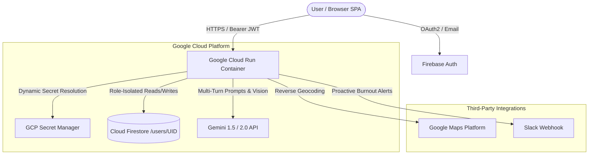

# ✨ Gemini Journal — Production AI Journaling on Google Cloud Run

> **Google Cloud Gen AI Academy APAC Edition – Cohort 3: "Accelerate AI with Cloud Run"**  
> An authenticated, secure, and production-grade AI-powered personal journaling web application built on Google Cloud Run, Cloud Firestore, Firebase Authentication, Google Cloud Secret Manager, and the Gemini API.

[](https://cloud.google.com/run)
[](https://firebase.google.com)
[](https://firebase.google.com/docs/firestore)
[](https://ai.google.dev)
[](https://cloud.google.com/secret-manager)

---

## 🌟 Overview & "The Why"

In an era of relentless notification overload, traditional personal diaries remain static, passive, and disjointed from our cognitive well-being. **Gemini Journal** reimagines personal reflection by turning private thoughts into an empathetic, active emotional compass. 

By combining the empathetic intelligence of **Gemini 1.5/2.0**, bulletproof per-user **Cloud Firestore isolation**, runtime **Google Cloud Secret Manager** credential hydration, and the elasticity of **Google Cloud Run**, Gemini Journal provides a private sanctuary where users can write, voice-record, and explore their memories through spatial maps and Spotify-style emotional recaps.

---

## 🚀 Key Features & Novelty ("What is Best")

### 1. 🛡️ The 4 Technical Baselines (Zero Disqualification)
- **User Authentication:** Robust sign-in powered by **Firebase Authentication** with backend token verification via Firebase Admin SDK.
- **Conversational AI:** Real-time multi-turn reflective brainstorming and Socratic questioning powered by the official **Gemini API**.
- **Role-Based Database Isolation:** Every document and chat history is strictly scoped under `/users/{userId}/...` in **Cloud Firestore** with enforceable `firestore.rules` preventing cross-user data access.
- **Runtime Secret Management:** API credentials and service keys are pulled dynamically at runtime via **Google Cloud Secret Manager**—never hardcoded.

### 2. 🎨 Winning Originality Features
- **📊 Spotify-Style "Mood Rewind":** An interactive, animated 5-slide year-end/monthly retrospective that synthesizes your emotional spectrum, identifies your **Soul Archetype** (e.g. *The Resilient Alchemist*), celebrates peak breakthroughs, and delivers an uplifting AI letter with confetti.
- **🗺️ Geotagged Memory Map:** Integrated with **Google Maps Platform** to cluster journal entries across global coordinates with mood-colored markers.
- **🚨 AI Burnout Radar & Slack Alerts:** Continuously computes rolling 7-day emotional velocity and cognitive strain, dispatching proactive wellness alerts to your Slack workspace.
- **🎙️ Voice & Multimodal Vision Journaling:** Record voice notes directly via Web Audio API and attach photos for instant Gemini vision analysis.

---

## 🏛️ System Architecture



---

## 🔒 Security Threat Model & Firestore Rules

### Zero Cross-User Database Leakage
All entries, chat sessions, and mood analytics are partitioned strictly under the owner's document path `/users/{userId}/...`.

```javascript
// firestore.rules
rules_version = '2';
service cloud.firestore {
  match /databases/{database}/documents {
    function isAuthenticated() { return request.auth != null; }
    function isOwner(userId) { return isAuthenticated() && request.auth.uid == userId; }

    match /users/{userId} {
      allow read, write: if isOwner(userId);

      match /entries/{entryId} {
        allow read, write: if isOwner(userId) && request.resource.data.userId == userId;
      }

      match /chat_sessions/{sessionId} {
        allow read, write: if isOwner(userId);
      }
    }
  }
}
```

---

## 🛠️ Local Development Setup

### Prerequisites
- Node.js 20+
- Google Cloud SDK (`gcloud`)
- Firebase CLI (optional for emulator)

### 1. Clone & Install Dependencies
```bash
git clone https://github.com/YOUR_USERNAME/gemini-journal.git
cd gemini-journal
npm install
```

### 2. Configure Environment
```bash
cp .env.example .env
# Fill in GEMINI_API_KEY, GCP_PROJECT_ID, and Firebase keys in .env
```

### 3. Run Automated Tests
```bash
npm test
```

### 4. Start Development Server
```bash
npm run dev
# Open http://localhost:5050
```

---

## 🐳 Dockerization & Cloud Run Deployment

### 1. Build and Submit Container Image
```bash
export PROJECT_ID=$(gcloud config get-value project)

gcloud builds submit --tag gcr.io/$PROJECT_ID/gemini-journal:latest
```

### 2. Deploy Live to Google Cloud Run
```bash
gcloud run deploy gemini-journal \
  --image gcr.io/$PROJECT_ID/gemini-journal:latest \
  --platform managed \
  --region asia-southeast1 \
  --allow-unauthenticated \
  --set-env-vars GCP_PROJECT_ID=$PROJECT_ID,NODE_ENV=production \
  --set-secrets GEMINI_API_KEY=projects/$PROJECT_ID/secrets/GEMINI_API_KEY:latest
```

---

## 🧪 Automated Verification Suite
Run the test runner to verify all baseline security guarantees and Gemini integrations:
```bash
npm test
```
- ✅ Secret Manager dynamic resolution & fallback
- ✅ Zero cross-user database leakage
- ✅ Gemini multi-turn conversation & Socratic mirroring
- ✅ Sentiment & cognitive strain scoring
- ✅ Spotify-style Mood Rewind synthesis
- ✅ Enterprise Slack burnout webhook formatting

---

## 📄 License
MIT License. Built for the **Google Cloud Gen AI Academy APAC Edition – Cohort 3 ("Accelerate AI with Cloud Run")**.
